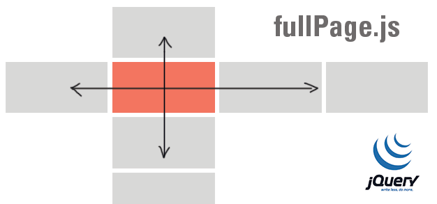
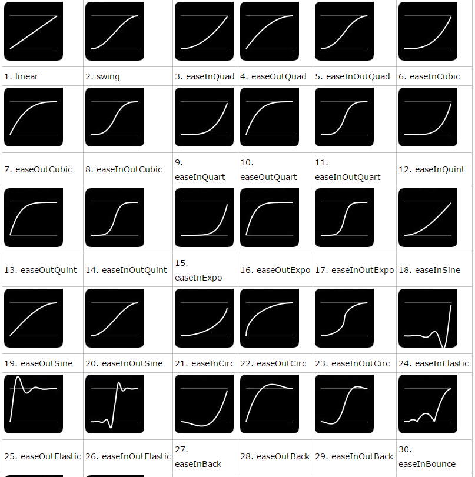

# 购物网站宣传页面


案例目的：

1. 复习---复习前面学过的HTML5+CSS3
2. 综合---综合运用jquery完成案例
3. 拓展---可以做宣传页面或者个人简历


## fullpage 全屏插件

全屏滚动效果，原生js也很好实现，主要是用 mousewheel  鼠标滚轮滚动事件， 来判断上滚动还是下滚动，之后设置每次滚动的高度为屏幕的高度即可。但是，虽然效果简单，但是兼容性很差，要做很多兼容处理及比较麻烦啦！（了解一下，有兴趣的同学可以研究一下）

fullPage.js 是一个基于 jQuery 的插件，它能够帮你很方便、很轻松的制作出全屏网站。

github 官网     https://github.com/alvarotrigo/fullPage.js  

中文演示地址   http://www.dowebok.com/demo/2014/77/    


主要功能有：

支持鼠标滚动

支持前进后退和键盘控制

多个回调函数

支持手机、平板触摸事件

支持 CSS3 动画

支持窗口缩放

窗口缩放时自动调整

可设置滚动宽度、背景颜色、滚动速度、循环选项、回调、文本对齐方式等等

## 引用文件

~~~html
<link rel="stylesheet" href="css/jquery.fullPage.css">
<script src="js/jquery.min.js"></script>
 <!-- jquery.easings.min.js 是必须的，用于 easing 参数，也可以使用完整的 jQuery UI 代替 -->
<script src="js/jquery.easings.min.js"></script>
 <script src="js/jquery.fullPage.js"></script>
~~~


## HTML 结构

~~~HTML
<div id="fullpage">
    <div class="section">第一屏</div>
    <div class="section">第二屏</div>
    <div class="section">
        <div class="slide">第三屏的第一屏</div>
        <div class="slide">第三屏的第二屏</div>
        <div class="slide">第三屏的第三屏</div>
        <div class="slide">第三屏的第四屏</div>
    </div>
    <div class="section">第四屏</div>
</div>
~~~



## JavaScript入口函数

~~~javascript
$(function(){
    $('#fullpage').fullpage();
});
~~~


## fullpage 详细参数

| 选项                                | 类型   | 默认值         | 说明                                   |
| --------------------------------- | ---- | ----------- | ------------------------------------ |
|                                   |      |             |                                      |
| verticalCentered                  | 字符串  | true        | 内容是否垂直居中                             |
| resize                            | 布尔值  | false       | 字体是否随着窗口缩放而缩放                        |
| sectionColor                      | 函数   | 无           | 设置背景颜色                               |
| anchors                           | 数组   | 无           | 定义锚链接                                |
| scrollingSpeed                    | 整数   | 700         | 滚动速度，单位为毫秒                           |
| easing                            | 字符串  | easeInQuart | 滚动动画方式                               |
| menu                              | 布尔值  | false       | 绑定菜单，设定的相关属性与 anchors 的值对应后，菜单可以控制滚动 |
| navigation                        | 布尔值  | false       | 是否显示项目导航                             |
| navigationPosition                | 字符串  | right       | 项目导航的位置，可选 left 或 right              |
|                                   |      |             |                                      |
| navigationTooltips                | 数组   | 空           | 项目导航的 tip                            |
| slidesNavigation                  | 布尔值  | false       | 是否显示左右滑块的项目导航                        |
| slidesNavPosition                 | 字符串  | bottom      | 左右滑块的项目导航的位置，可选 top 或 bottom         |
| controlArrowColor                 | 字符串  | #fff        | 左右滑块的箭头的背景颜色                         |
| loopBottom                        | 布尔值  | false       | 滚动到最底部后是否滚回顶部                        |
| loopTop                           | 布尔值  | false       | 滚动到最顶部后是否滚底部                         |
| loopHorizontal                    | 布尔值  | true        | 左右滑块是否循环滑动                           |
| autoScrolling                     | 布尔值  | true        | 是否使用插件的滚动方式，如果选择 false，则会出现浏览器自带的滚动条 |
| scrollOverflow                    | 布尔值  | false       | 内容超过满屏后是否显示滚动条                       |
| css3                              | 布尔值  | false       | 是否使用 CSS3 transforms 滚动              |
| paddingTop                        | 字符串  | 0           | 与顶部的距离                               |
| paddingBottom                     | 字符串  | 0           | 与底部距离                                |
| fixedElements                     | 字符串  | 无           |                                      |
| normalScrollElements              |      | 无           |                                      |
| keyboardScrolling                 | 布尔值  | true        | 是否使用键盘方向键导航                          |
| touchSensitivity                  | 整数   | 5           |                                      |
| continuousVertical                | 布尔值  | false       | 是否循环滚动，与 loopTop 及 loopBottom 不兼容    |
| animateAnchor                     | 布尔值  | true        |                                      |
| normalScrollElementTouchThreshold | 整数   | 5           |                                      |

### fullPage.js 方法

注意方法的使用时需要添加：

$.fn.fullpage   比如

~~~javascript
$.fn.fullpage.moveTo(1);
~~~
| 名称                     | 说明                      |
| ---------------------- | ----------------------- |
| moveSectionUp()        | 向上滚动                    |
| moveSectionDown()      | 向下滚动                    |
| moveTo(section, slide) | 滚动到                     |
| moveSlideRight()       | slide 向右滚动              |
| moveSlideLeft()        | slide 向左滚动              |
| setAutoScrolling()     | 设置页面滚动方式，设置为 true 时自动滚动 |
| setAllowScrolling()    | 添加或删除鼠标滚轮/触控板控制         |
| setKeyboardScrolling() | 添加或删除键盘方向键控制            |
| setScrollingSpeed()    | 定义以毫秒为单位的滚动速度           |


### 回调函数

| 名称             | 说明                                       |
| -------------- | ---------------------------------------- |
| afterLoad      | 滚动到某一屏后的回调函数，接收 anchorLink 和 index 两个参数，anchorLink 是锚链接的名称，index 是序号，从1开始计算 |
| onLeave        | 滚动前的回调函数，接收 index、nextIndex 和 direction 3个参数：index 是离开的“页面”的序号，从1开始计算；nextIndex 是滚动到的“页面”的序号，从1开始计算；direction 判断往上滚动还是往下滚动，值是 up 或 down。 |
| afterRender    | 页面结构生成后的回调函数，或者说页面初始化完成后的回调函数            |
| afterSlideLoad | 滚动到某一水平滑块后的回调函数，与 afterLoad 类似，接收 anchorLink、index、slideIndex、direction 4个参数 |
| onSlideLeave   | 某一水平滑块滚动前的回调函数，与 onLeave 类似，接收 anchorLink、index、slideIndex、direction 4个参数 |


##  jQuery Easing.js 插件

介绍：easing是jquery的一个插件，使用它可以创建更加绚丽的动画效果。

环境：因为easing是jQuery的插件，所以必须是在引入jquery之后再引入它

如果只想要简单的写法就用 

```javascript	
$(".car").animate({"left": "150%"},  4000, "easeInElastic", function() {});
```


~~~javascript
easing:格式为json,{duration:持续时间,easing:过渡效果,complete:成功后的回调函数}
~~~

~~~javascript
$(element).animate({ 
    height:500, 
    width:600 
    },{ 
    easing: 'easeInOutQuad', 
    duration: 500, 
    complete: function(){} 
}); 
~~~


1. linear
2. swing
3. easeInQuad
4. easeOutQuad
5. easeInOutQuad
6. easeInCubic
7. easeOutCubic
8. easeInOutCubic
9. easeInQuart
10. easeOutQuart
11. easeInOutQuart
12. easeInQuint
13. easeOutQuint
14. easeInOutQuint
15. easeInExpo
16. easeOutExpo
17. easeInOutExpo
18. easeInSine
19. easeOutSine
20. easeInOutSine
21. easeInCirc
22. easeOutCirc
23. easeInOutCirc
24. easeInElastic
25. easeOutElastic
26. easeInOutElastic
27. easeInBack
28. easeOutBack
29. easeInOutBack
30. easeInBounce
31. easeOutBounce
32. easeInOutBounce



https://matthewlein.com/experiments/easing.html


##  动画复习


